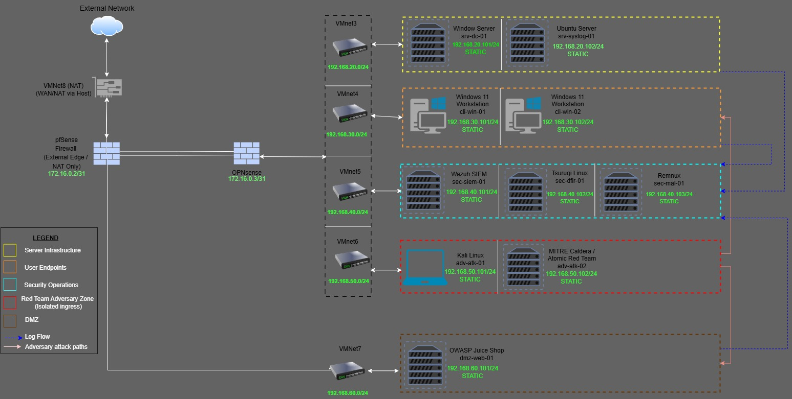

# IronGate Solutions

  

This project contains the full design and configuration of a replicated virtualized Security Operations Center (SOC) lab environment; simulating a real-world enterprise network environment, designed to test detection and defense capabilities against simulated attacks.

## ⚙️ Project Overview
- 🔐 **Segmented network architecture** using dual firewalls (pfSense as edge, OPNsense as internal)
- 🧨 **Red Team Adversary Zone** for simulating attacks with Kali Linux and MITRE Caldera
- 🌐 **DMZ environment** with a vulnerable web application (OWASP Juice Shop) for external threat emulation
- 📊 **Centralized logging and SIEM** setup with Wazuh, REMnux, and DFIR tooling
- 🔎 **Multiple log sources and detection paths** for end-to-end monitoring and response

## Diagram

## 🧱 Network Segmentation

| Segment Name            | Purpose                        | libvirt Network | Subnet            | Gateway IP     |
|-------------------------|--------------------------------|--------|-------------------|----------------|
| External (WAN)          | NAT to Internet                | default (NAT) | N/A (DHCP/NAT)    | Provided by libvirt |
| Transit Link            | pfSense ↔ OPNsense link        | transit-net | 172.16.0.2/31     | 172.16.0.2 (pfSense) / 172.16.0.3 (OPNsense) |
| Server Infrastructure   | AD, Syslog servers             | infra-net | 192.168.20.0/24   | 192.168.20.1   |
| User Endpoints          | Workstations                   | users-net | 192.168.30.0/24   | 192.168.30.1   |
| Security Operations     | SIEM, DFIR tools               | secops-net | 192.168.40.0/24   | 192.168.40.1   |
| Red Team Adversary Zone | Kali, Caldera (Isolated Ingress) | red-net | 192.168.50.0/24 | 192.168.50.1   |
| DMZ                     | OWASP Juice Shop               | dmz-net | 192.168.60.0/24   | 192.168.60.1   |

## Goals
- Practice SOC detection and response
- Simulate real-world attack scenarios
- Test firewall rules, SIEM, endpoint logging

## ⚠️ Disclaimer
This lab is for educational and authorized testing purposes only. All malware samples, attack tools, and techniques should only be used in controlled environments and/or with explicit permission.
