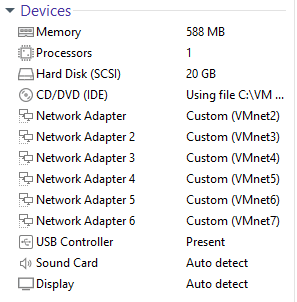
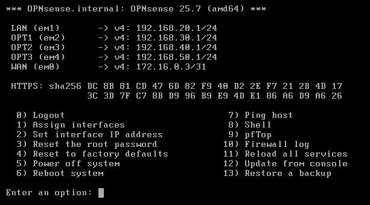
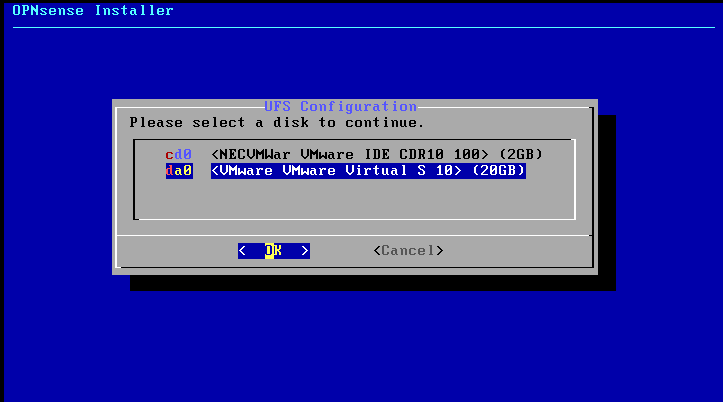
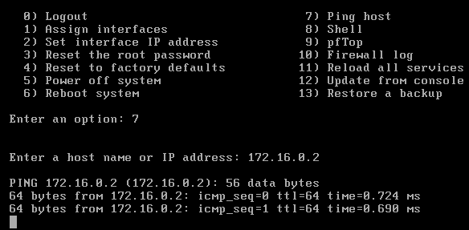
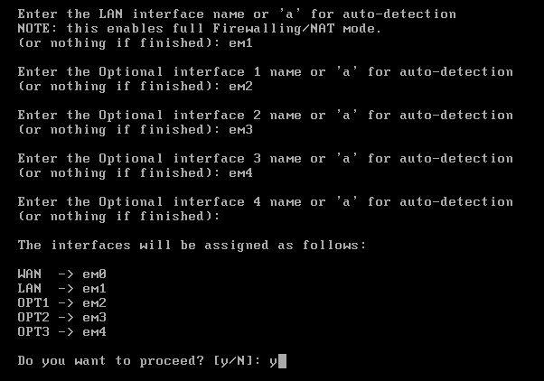

# OPNsense Installation – IronGate Solutions Lab

## VM Setup (VMware Workstation Pro)
- **Name**: OPNsense-FW
- **CPU**: 1 vCPU, 588 MB RAM
- **Disk**: 20 GB, single file
- **Network Adapters**:
  - NIC1 → **WAN** → VMnet2 (/31 link to pfSense)
  - NIC2 → **LAN** → VMnet3 (Server Infra, 192.168.20.0/24)
  - NIC3 → **OPT1** → VMnet4 (User Endpoints, 192.168.30.0/24)
  - NIC4 → **OPT2** → VMnet5 (Security Ops, 192.168.40.0/24)
  - NIC5 → **OPT3** → VMnet6 (Red Team Zone, 192.168.50.0/24)
  - *(later)* NIC6 → **OPT4** → VMnet7 (DMZ, 192.168.60.0/24)

*Figure 1 – OPNsense VM setup in VMware Workstation.*

---

## ISO Boot
1. Boot VM from `OPNsense-<version>-amd64.iso`.
2. Select **Install (UFS)**.

*Figure 2 – Installer boot menu.*

*Figure 3 – Install method selection.*

*Figure 4 – Disk configuration during install.*

---

## Interface Assignments

### WAN (Transit to pfSense)
- IP: `172.16.0.3/31`
- Gateway: `172.16.0.2` (pfSense)

### LAN (Server Infra)
- IP: `192.168.20.1/24`
- Gateway: none

### OPT Interfaces
- OPT1 (User Endpoints): `192.168.30.1/24`
- OPT2 (Security Ops): `192.168.40.1/24`
- OPT3 (Red Team Zone): `192.168.50.1/24`
- *(later)* OPT4 (DMZ): `192.168.60.1/24`

*Figure 5 – Interfaces summary after setup.*

*Figure 6 – Final console state showing interface configuration.*

---

## Interface/IP Plan

| OPNsense Interface | VMware VMnet | Subnet            | Gateway IP          | Notes                                |
|--------------------|--------------|-------------------|---------------------|--------------------------------------|
| **WAN (em0)**      | VMnet2       | `172.16.0.2/31`   | `172.16.0.2` (pfSense) | OPNsense IP = `172.16.0.3/31`        |
| **LAN (em1)**      | VMnet3       | `192.168.20.0/24` | —                   | OPNsense IP = `192.168.20.1/24`      |
| **OPT1 (em2)**     | VMnet4       | `192.168.30.0/24` | —                   | OPNsense IP = `192.168.30.1/24`      |
| **OPT2 (em3)**     | VMnet5       | `192.168.40.0/24` | —                   | OPNsense IP = `192.168.40.1/24`      |
| **OPT3 (em4)**     | VMnet6       | `192.168.50.0/24` | —                   | OPNsense IP = `192.168.50.1/24`      |
| *(later)* OPT4     | VMnet7       | `192.168.60.0/24` | —                   | OPNsense IP = `192.168.60.1/24`      |

---

## Final State
- **WAN (em0):** `172.16.0.3/31` (gateway = pfSense `172.16.0.2`).
- **LAN (em1):** `192.168.20.1/24` (gateway for Server Infra).
- **OPT networks:** `.1` gateway on each subnet.
- **Rules (default):**
  - WAN: blocks all inbound traffic by default.
  - LAN/OPT: allow all outbound traffic by default.
- **Result:** OPNsense acts as the enterprise firewall, routing all internal networks through pfSense for internet access.
