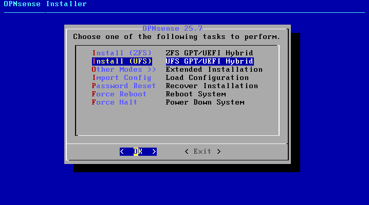

# OPNsense Installation – IronGate Solutions Lab

This guide documents deploying **OPNsense** as the **internal (enterprise) firewall** in the IronGate lab using **virt-manager / QEMU-KVM (libvirt)**.

> ⚠️ **Important change vs older VMware docs:**  
> The transit link is implemented as **/30** in this build (not /31) because `/31` was rejected during console configuration.  
> **pfSense transit:** `172.16.0.2/30`  
> **OPNsense transit:** `172.16.0.1/30`  
> (Both sit on `172.16.0.0/30`.)

---

## VM Setup (KVM / libvirt)

- **Name:** `OPNsense-FW`
- **CPU:** 1–2 vCPU (recommended 2)
- **RAM:** 2–4 GB recommended  
  *(Older doc showed 588 MB; that’s usually too tight for a smooth experience.)*
- **Disk:** 20 GB (qcow2 recommended)

### Network Adapters (libvirt networks)

Attach NICs to the following libvirt networks:

- NIC1 → **WAN** → `transit-net` (transit link to pfSense)
- NIC2 → **LAN** → `infra-net` (Server Infrastructure `192.168.20.0/24`)
- NIC3 → **OPT1** → `users-net` (User Endpoints `192.168.30.0/24`)
- NIC4 → **OPT2** → `secops-net` (Security Ops `192.168.40.0/24`)
- NIC5 → **OPT3** → `red-net` (Red Team `192.168.50.0/24`)
- NIC6 → **OPT4** → `dmz-net` (DMZ `192.168.60.0/24`)

> ✅ **No NIC on libvirt `default` (NAT)** for OPNsense.  
> Only **pfSense WAN** uses `default`. OPNsense reaches the internet via pfSense over the transit link.

  
*Figure 1 – OPNsense VM settings (hypervisor-agnostic screenshot).*

---

## ISO Boot & Install

1. Boot the VM from `OPNsense-<version>-dvd-amd64.iso`
2. Choose **Install (UFS)** (recommended in a VM)

> **Disk note:** Select the **virtual disk** (e.g., `ada0`), **not** `cd0`.

  
*Figure 2 – Installer boot menu.*

  
*Figure 3 – Install method selection.*

  
*Figure 4 – Disk configuration during install.*

### Partition Scheme Note (BIOS vs UEFI)
- If your VM firmware is **BIOS**, use **GPT** without forcing EFI mountpoints.
- If you hit an EFI-related error (e.g., failing `/mnt/boot/efi` mount), ensure the VM firmware matches the installer layout (or switch to UEFI firmware and retry).

---

## Interface Assignment (libvirt / vtnet mapping)

On KVM, interfaces typically appear as `vtnet0`, `vtnet1`, etc.

In this build, NICs mapped as follows (confirmed via MAC matching):

- `vtnet0` = `transit-net` (WAN)
- `vtnet1` = `dmz-net`
- `vtnet2` = `infra-net` (LAN)
- `vtnet3` = `red-net`
- `vtnet4` = `secops-net`
- `vtnet5` = `users-net`

> If your interface order differs, match NICs using MAC addresses in virt-manager vs the console list.

### LAGGs / VLANs Prompts
- **LAGGs:** `n` (not needed)
- **VLANs:** `n` (not using 802.1Q tagging in this lab; each segment is a separate libvirt “switch”)

---

## IP Addressing (Final Configuration)

### WAN (Transit to pfSense)
- **Interface:** `vtnet0` (`transit-net`)
- **OPNsense IP:** `172.16.0.1/30`
- **Gateway:** `172.16.0.2` (pfSense transit IP)

> Why not `172.16.0.3/30`?  
> `172.16.0.3` is the **broadcast** address in `172.16.0.0/30`.  
> Usable hosts are `.1` and `.2`. pfSense is `.2`, so OPNsense uses `.1`.

### LAN (Server Infrastructure)
- **Interface:** `vtnet2` (`infra-net`)
- **IP:** `192.168.20.1/24`
- **Gateway:** none

### OPT Interfaces
- **OPT1 (Users):** `192.168.30.1/24` (`users-net`)
- **OPT2 (SecOps):** `192.168.40.1/24` (`secops-net`)
- **OPT3 (Red):** `192.168.50.1/24` (`red-net`)
- **OPT4 (DMZ):** `192.168.60.1/24` (`dmz-net`)

> ✅ **Only WAN has an upstream gateway.**  
> LAN/OPT interfaces should be configured with **no gateway**.

  
*Figure 5 – Interfaces summary after setup.*

  
*Figure 6 – Final console state showing interface configuration.*

---

## Interface/IP Plan (Updated for libvirt)

| OPNsense Interface | libvirt Network | Subnet             | OPNsense IP         | Gateway / Notes |
|---|---|---:|---:|---|
| **WAN (vtnet0)** | `transit-net` | `172.16.0.0/30` | `172.16.0.1/30` | **GW:** `172.16.0.2` (pfSense) |
| **LAN (vtnet2)** | `infra-net` | `192.168.20.0/24` | `192.168.20.1/24` | No gateway |
| **OPT1 (vtnet5)** | `users-net` | `192.168.30.0/24` | `192.168.30.1/24` | No gateway |
| **OPT2 (vtnet4)** | `secops-net` | `192.168.40.0/24` | `192.168.40.1/24` | No gateway |
| **OPT3 (vtnet3)** | `red-net` | `192.168.50.0/24` | `192.168.50.1/24` | No gateway |
| **OPT4 (vtnet1)** | `dmz-net` | `192.168.60.0/24` | `192.168.60.1/24` | No gateway |

---

## Validation (Phase 1 “Done” Checks)

### Transit link
From OPNsense console:
- Ping pfSense transit: `ping 172.16.0.2` ✅

### Upstream internet via pfSense
From OPNsense console:
- `ping 1.1.1.1` ✅

> If transit ping works but internet ping fails, the issue is typically on pfSense (outbound NAT/rules) or missing return routes.

---

## Web GUI Access (Important Note)

Because `infra-net/users-net/...` are **isolated libvirt networks**, your **host OS cannot directly browse** to `https://192.168.20.1` unless you provide a management path.

**Recommended approach (lab-pure):**
- Use a **SecOps VM** on `secops-net` to access the GUI internally.

**Temporary setup option (for convenience only):**
- Add a **temporary management NIC** on libvirt `default` (NAT), access GUI, then remove it.

---

## Final State

- **Role:** OPNsense operates as the internal enterprise firewall routing all internal segments toward pfSense.
- **WAN:** `172.16.0.1/30` → gateway `172.16.0.2` (pfSense)
- **LAN/OPT:** `.1/24` gateway per segment (`192.168.20.1`, `30.1`, `40.1`, `50.1`, `60.1`)
- **Default behavior:** WAN inbound blocked; LAN/OPT outbound allowed (tighten later).
- **Result:** Segmented networks route through OPNsense, then through pfSense for internet access.
