# pfSense Installation – IronGate Solutions Lab

## VM Setup (KVM/Libvirt)
- **Name**: pfSense-FW
- **CPU**: 1 vCPU, 1 core
- **RAM**: 1–2 GB
- **Disk**: 10 GB, single file
- **Network Adapters**:
  - NIC1 → **WAN** → Default (NAT)
  - NIC2 → **Transit** → transit-net (/31 link to OPNsense)

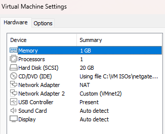
*Figure 1 – pfSense VM setup in VMware Workstation.*

---

1. Boot VM from `pfSense-CE-<version>-amd64.iso`.
2. Select **Install pfSense**.

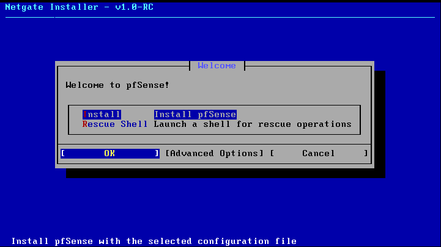
*Figure 2 – Installer start screen.*

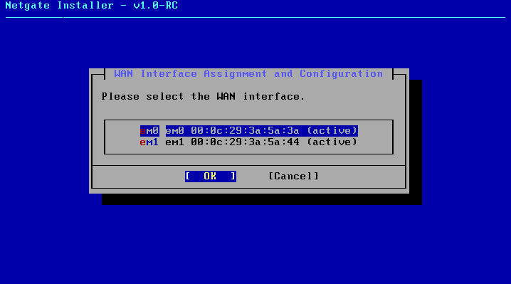
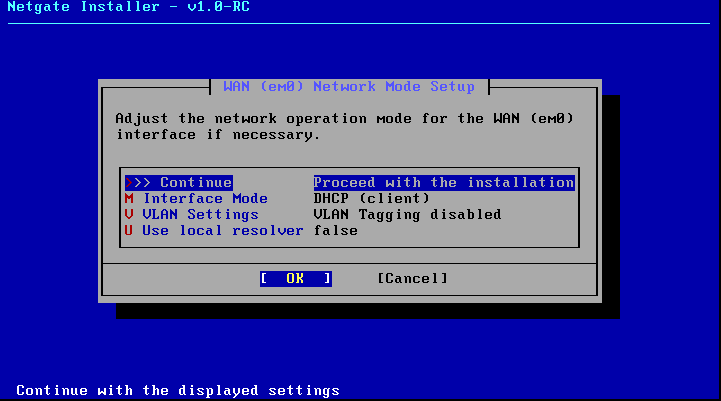

---

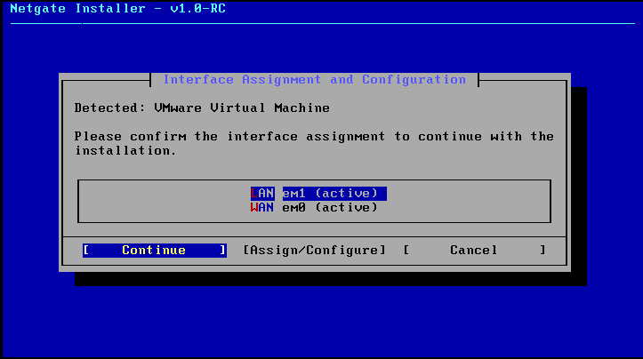
*Figure 4 – LAN (em1) assigned to transit.*

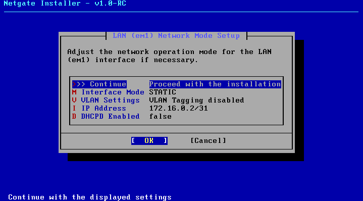
*Figure 5 – LAN configured as 172.16.0.2/31, DHCP disabled.*

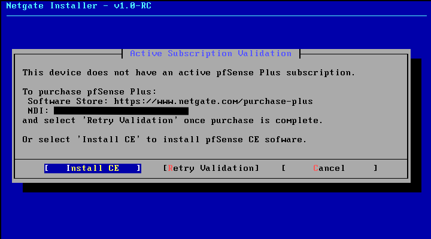

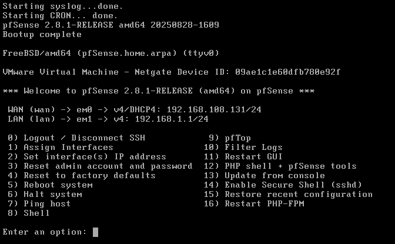
*Figure 6 – Console showing final assignments.*

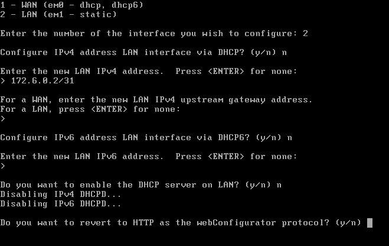
*Figure 7 – Reconfiguring LAN IP.*

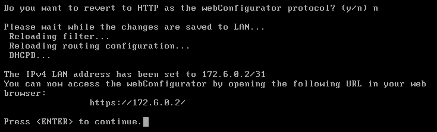
*Figure 8 – pfSense applies LAN changes, confirming 172.16.0.2/31.*

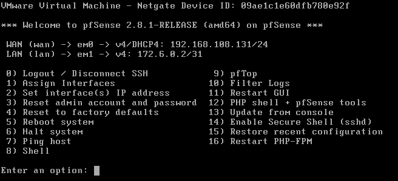
*Figure 9 – Post-install summary: WAN (DHCP), LAN 172.16.0.2/31.*

(Please note I made an IP error in above screenshots. Rectified to the correct IP of 172.16.0.2/31)

---

## Final State

- **Role:** pfSense operates as the upstream ISP edge device.
- **WAN (em0):** DHCP from default NAT (external connectivity)
- **LAN (em1):** Static IP 172.16.0.2/31 (transit link to OPNsense) 
- **Firewall Rules (default):** 
  - **WAN:** All inbound traffic is blocked by default = nothing from “the internet” can reach pfSense unless explicitly allowed.
  - **LAN:** All outbound traffic is permitted by default = devices behind pfSense (like OPNsense) can initiate any connection out to the internet.
  - **Stateful inspection:** Return traffic for allowed outbound connections is automatically permitted. 
